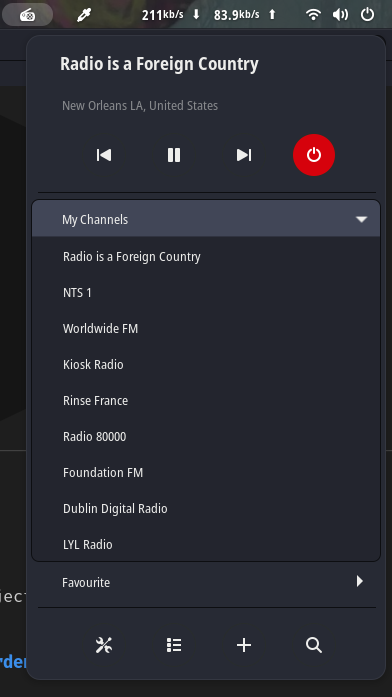

# Radio Garden for Gnome (Unoffcial)
  

This is an unoffical extension of [radio.garden](http://radio.garden) website. Goal is not to steal intellectual property of the creators, but rather serve it for public for free. This project uses radio garden's private API.

## Project Phase

This project is still in library testing phase and about to UI development soon.

## Previews

## Contribution and Feedback

Please do not hesitate to submit issues or pull requests. Your help would be appreciated.

## Copyright

We are ready to take this project down if concern authority of [radio.garden](http://radio.garden) asks us to. Please contact us with [our mail](mailto://0x0is1@proton.me).
